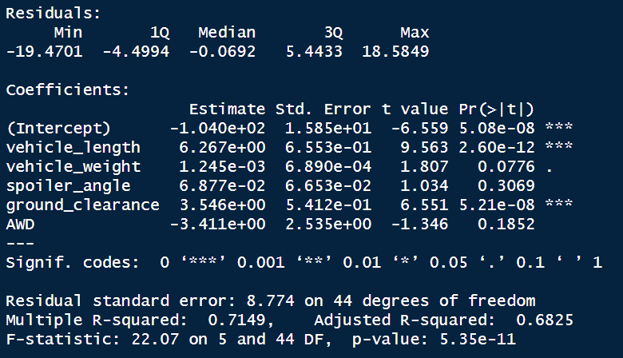
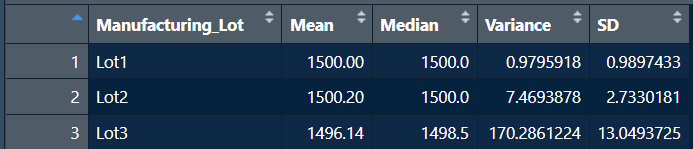
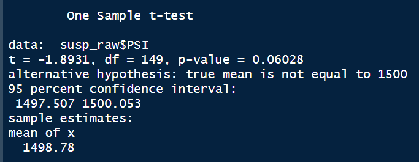
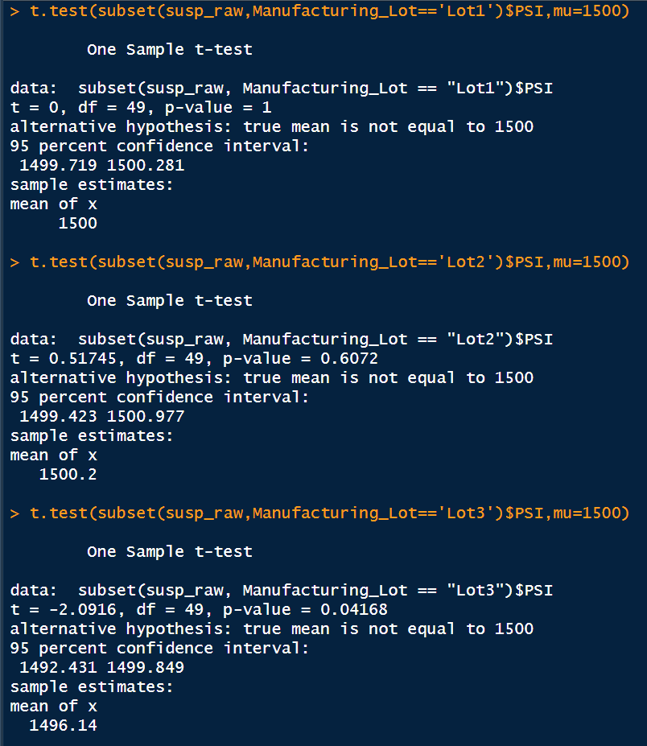

# MechaCar_Statistical_Analysis
## Project Overview
AutosRUs’ newest prototype, the MechaCar, is suffering from production troubles that are blocking the manufacturing team’s progress. In this project we will asssist the data analytics team to review the production data for insights that may help the manufacturing team.

## Linear Regression to Predict MP

  - The Pr(>|t|) tells us how likely it is that the coefficients may be responsible for random amount of variance to the mpg values in the dataset. Given spoiler_angle (Pr(>|t|) = 0.3069), AWD (Pr(>|t|) 0.1852) and vehicle_weight (Pr(>|t|) 0.0776), provide a non-random amount of variance.
  - P value of 0.00000000005 concludes that the slope of our linear model is not zero because of the very small p-value.
  - The r-squared value suggests that linear model predicts mpg of MechaCar prototypes 71 out of 100 times effectively.
## Summary Statistics on Suspension Coils
Total Summary:

Lot Summary: 

Individually, Lots 1 and 2 met specifications and Lot 3 needs a closer inspection as the variance is too high. However, the overall aggregate of all three 
lots together has a variance of only 62 PSI, which remains under the given limit.

## T-Tests on Suspension Coils

Lot 1 yeilded a p-value of 1, Lot 2 yeilded a p-value of 0.6, and Lot 3 yeilded a p-value of 0.04 (Lot 3 needs to be reevaluated). While, we do see a statistically significant difference in the means between Lot 3 and the population, each Lot yeilded a confidence interfal of 95 percent which means they are close to eachother in regards to being at 1500 psi.

## Comparing the MechaCar to the Competition
This study included design a statistical study to compare performance of the MechaCar vehicles against performance of vehicles from other manufacturers.
  - For car enthusiasts, the most important specifications are related to fuel economy, horsepower, quarter mile time, hauling capacity, and whether the vehicle has a moon roof. Although consumers have price set in their mind, it is important to include both the style and price of the car when making a comparison. For the study, Selling price as dependent variable and rest would be independent.
  -  Null Hypothesis (Ho) based on the key factors, the MechaCAr is priced right. Alternative Hypothesis (Ha) based on the key factors, the MechaCAr is not priced right.
  -  Multiple linear regression is a type of statistical model that helps predict how different factors affect a particular outcome. For example, if you want to know how much a particular factor affects the price of an object, you could use a multiple linear regression model to figure out which factors are most likely to affect the price.
  -  Multiple independent variables to account for parts of the total variance observed in the dependent variable, a lot of different data like the selling price and all the variables that have the most impact on the selling price will be needed to run the test effectively.
